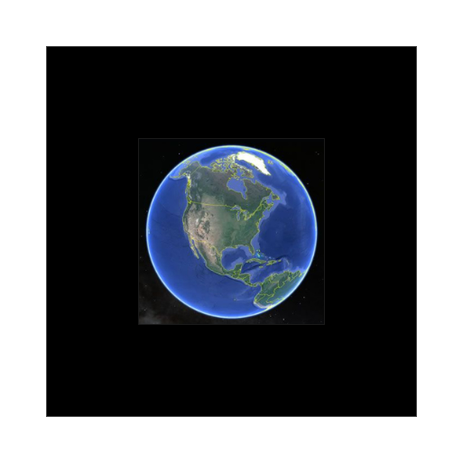

# Data-VisualizAR
Visualize 3D models (.obj) or data using augmented reality on your mobile phone through the web with [AR.js](https://github.com/jeromeetienne/AR.js)

- :iphone: Open this link on your phone [https://tinyurl.com/web-ar-obj](https://pearsonkyle.github.io/Data-VisualizAR/static/github.html)

- :camera: Point camera at picture below 



## Web server
```python 
python web_ar.py
``` 

URL Paths: 
```
/
/model
/video
/models/<name>
```

## Coming Soon
AR & VR visualizations of planetary collisions from SPH simulations 

### [Web-AR](https://github.com/jeromeetienne/AR.js)


### [Web-VR](https://aframe.io/)


### [Unity](https://unity.com/)


## Converting [Paraview](https://www.paraview.org/) Models with [Blender](https://www.blender.org/) (.x3d -> .obj)

1. Open Blender (v2.79)
2. Navigate to script editor (crtl+right arrow)x3
3. Open new script. Press button "+ New"
4. Delete the square model, if present
5. Paste code below 
```python
import bpy
import glob 

file_loc = "C:\\Users\\Kyle\\Documents\\SPH_objects\\"
files = glob.glob(file_loc+"*.x3d")
for i in range(len(files)):

    imported_object = bpy.ops.import_scene.x3d(filepath=files[i])
    obj = bpy.context.selected_objects[0]
    exported_object = bpy.ops.export_scene.obj(filepath=files[i].split('.x3d')[0]+'.obj')

    print('Imported name: ', obj.name)
    bpy.data.objects[obj.name].select = True   
    bpy.ops.object.delete()
    
```
See Reference 

## Creating an animation from multiple obj files in Blender 
```python
# https://docs.blender.org/api/2.79b/info_quickstart.html
import bpy
import glob 

file_loc = "C:\\Users\\Kyle\\Documents\\Unity Projects\\SPH_Visualization\\Assets\\Python\\Data-VisualizAR\\static\\models\\"
files = glob.glob(file_loc+"*.x3d")

scene = bpy.context.scene
scene.objects.keys()

objs = [] 
for i in range(len(files)):
    imported_object = bpy.ops.import_scene.x3d(filepath=files[i])
    obj = bpy.context.selected_objects[0]
    obj.hide = True
    obj.hide_render = True
    objs.append( obj)

    # delete other objects from import 

def hide_true(objs,idx):
    for i in range(len(objs)):
        if i == idx:
            objs[i].hide = False
            objs[i].keyframe_insert(data_path="hide")
            objs[i].keyframe_insert(data_path="hide_render")

        else:
            objs[i].hide = True
            objs[i].keyframe_insert(data_path="hide")
            objs[i].keyframe_insert(data_path="hide_render")

for i in range(len(files)):
    scene.frame_set(i*7.5)    
    hide_true(objs,i)

#exported_object = bpy.ops.export_scene.obj(filepath='SPH.obj')
```